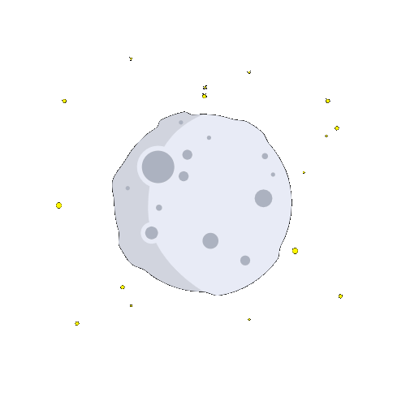

<h1>Hi, I´m Marco 👋🏻</h1>
 

I am a programming student, currently studying computer engineering, my goal is to become a fullstack webdeveloper. My passion for programming and the power it brings to the world is what motivates me to learn more and more.
I am also a diy maker, i love to do projects with arduino, raspberry pi or anything with a microprocessor 😁.
I love talk about space exploration, EV cars and tech in general.

 

<h3>📖 Trying to have time to learn:</h3>
<ul>
    <li>
        

            <a href="https://nextjs.org/">Next Js</a>
        

    </li>
    <li>
        

            <a href="https://github.com/expressjs/express">Express Js</a>
        

    </li>
    <li>
        

            <a href="https://github.com/microsoft/TypeScript">Typescript</a>
        

    </li>
    <li>
        

            <a href="https://flutter.dev/">Flutter</a>
        

    </li>
</ul>
 
<h3>📖 Currently working with:</h3>
<ul>
    <li>
        

           <a href="#">C</a>
        

    </li>
    <li>
        

            <a href="https://www.php.net/docs.php">Php</a>
        

    </li>
    <li>
        

            <a href="https://dev.mysql.com/">Mysql</a>
        

    </li>
    <li>
        

            <a href="#">JavaScript</a>
        

    </li>
</ul>

 

    

